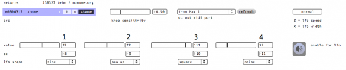

# returns

simple yet versatile cc output from the arc. sensitivity and lfo control. anti-aliased point indication.

created by: tehn

http://vimeo.com/63240734

added features by søren andreasen

- basic grid support
- clip launch
- note out

http://vimeo.com/86750947